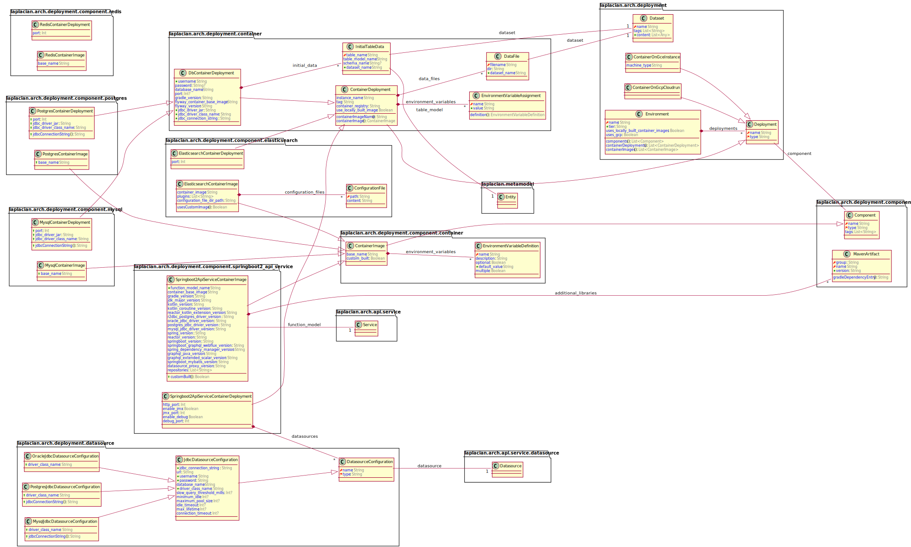

<!-- @head-content@ -->
# laplacian-arch/deployment.domain-model

This model represents the deployment configuration of a system.


*Read this in other languages*: [[日本語](README_ja.md)] [[简体中文](README_zh.md)]
<!-- @head-content@ -->

<!-- @toc@ -->
## Table of contents
- [Overview](#overview)

  * [Model overview](#model-overview)

- [Usage](#usage)

- [Index](#index)

  * [Entity list](#entity-list)

  * [Script List](#script-list)

  * [Source code list](#source-code-list)


<!-- @toc@ -->

<!-- @main-content@ -->
## Overview


### Model overview


The following diagram explains the entities included in this module and the relationship
between them.


## Usage

To apply this Model module, add the following entry to your project definition.
```yaml
project:
  models:
  - group: laplacian-arch
    name: deployment.domain-model
    version: 1.0.0
```

You can run the following command to see a list of resources affected by the application of this module and their contents.
```console
$ ./script/generate --dry-run

diff --color -r PROJECT_HOME/.NEXT/somewhere/something.md PROJECT_HOME/somewhere/something.md
1,26c1,10
< content: OLD CONTENT
---
> content: NEW CONTENT
```

If there is no problem, execute the following command to reflect the change.
```console
$ ./script/generate

```


## Index


### Entity list


- [**BucketScriptAggregate**](<./doc/entities/BucketScriptAggregate.md>)
bucket_script_aggregate
- [**BucketScriptPath**](<./doc/entities/BucketScriptPath.md>)
bucket_script_path
- [**BucketSelectorAggregate**](<./doc/entities/BucketSelectorAggregate.md>)
bucket_selector_aggregate
- [**BucketSortAggregate**](<./doc/entities/BucketSortAggregate.md>)
bucket_sort_aggregate
- [**DateHistogramAggregate**](<./doc/entities/DateHistogramAggregate.md>)
date_histogram_aggregate
- [**DateHistogramInterval**](<./doc/entities/DateHistogramInterval.md>)
date_histogram_interval
- [**DateHistogramCalendarInterval**](<./doc/entities/DateHistogramCalendarInterval.md>)
date_histogram_calendar_interval
- [**DateHistogramFixedInterval**](<./doc/entities/DateHistogramFixedInterval.md>)
date_histogram_fixed_interval
- [**DateRangeAggregate**](<./doc/entities/DateRangeAggregate.md>)
date_range_aggregate
- [**AggregateGroupRange**](<./doc/entities/AggregateGroupRange.md>)
aggregate_group_range
- [**FilterAggregate**](<./doc/entities/FilterAggregate.md>)
filter_aggregate
- [**FiltersAggregate**](<./doc/entities/FiltersAggregate.md>)
filters_aggregate
- [**KeyedFilter**](<./doc/entities/KeyedFilter.md>)
keyed_filter
- [**SumAggregate**](<./doc/entities/SumAggregate.md>)
sum_aggregate
- [**AvgAggregate**](<./doc/entities/AvgAggregate.md>)
avg_aggregate
- [**MinAggregate**](<./doc/entities/MinAggregate.md>)
min_aggregate
- [**MaxAggregate**](<./doc/entities/MaxAggregate.md>)
max_aggregate
- [**ValueCountAggregate**](<./doc/entities/ValueCountAggregate.md>)
value_count_aggregate
- [**TermsAggregate**](<./doc/entities/TermsAggregate.md>)
A multi-bucket value source based aggregation where buckets are dynamically built
- one per unique value.
- [**ElasticsearchAggregate**](<./doc/entities/ElasticsearchAggregate.md>)
elasticsearch_aggregate
- [**ElasticsearchQuerySort**](<./doc/entities/ElasticsearchQuerySort.md>)
elasticsearch_query_sort
- [**ElasticsearchQueryScoreSort**](<./doc/entities/ElasticsearchQueryScoreSort.md>)
elasticsearch_query_score_sort
- [**ElasticsearchQueryFieldSort**](<./doc/entities/ElasticsearchQueryFieldSort.md>)
elasticsearch_query_field_sort
- [**Component**](<./doc/entities/Component.md>)
component
- [**PostgresTestDb**](<./doc/entities/PostgresTestDb.md>)
postgres_test_db
- [**ElasticsearchServer**](<./doc/entities/ElasticsearchServer.md>)
elasticsearch_server
- [**ElasticsearchConfigurationFiles**](<./doc/entities/ElasticsearchConfigurationFiles.md>)
elasticsearch_configuration_files
- [**DatasourceMapping**](<./doc/entities/DatasourceMapping.md>)
datasource_mapping
- [**ExternalRestApiMapping**](<./doc/entities/ExternalRestApiMapping.md>)
external_rest_api_mapping
- [**SearchEngineMapping**](<./doc/entities/SearchEngineMapping.md>)
search_engine_mapping
- [**Springboot2ApiService**](<./doc/entities/Springboot2ApiService.md>)
springboot2_api_service
- [**Deployment**](<./doc/entities/Deployment.md>)
deployment
- [**ContainerOnGceInstance**](<./doc/entities/ContainerOnGceInstance.md>)
container_on_gce_instance
- [**ContainerOnGcpCloudrun**](<./doc/entities/ContainerOnGcpCloudrun.md>)
container_on_gcp_cloudrun
- [**ContainerOnLocalMachine**](<./doc/entities/ContainerOnLocalMachine.md>)
container_on_local_machine
- [**Environment**](<./doc/entities/Environment.md>)
environment
- [**ExternalRestApiEndpoint**](<./doc/entities/ExternalRestApiEndpoint.md>)
external_rest_api_endpoint
### Script List


- [./script/generate.sh](<./scripts/generate.sh>)

  Generates the resources in each directory of `src/` `model/` `template/` in this project.
  The results are reflected in each directory of `dest/` `doc/` `script/`.

  *Generator input files*

  - `src/`
    Stores static resources that are not processed the generator.
    The contents of this directory are copied directly into the `dest/` directory.

  - `model/`
    Stores the static model data files written in *YAML* or *JSON* format used for the generation.

  - `template/`
    This directory contains the template files used for the generation.
    Files with a extension `.hbs` will be handled as templates. All other files are copied as is.

    - `template/dest` `template/doc` `template/scripts`
      Each of these directories contains the template files of the resource to be output
      in the directory `dest/` `doc/` `scripts`.

    - `template/model` `template/template`
      These directories store template files updating the contents of `template/` and `model/` used for the generation.
      If the content of `template/` `model/` is updated as a result of the generation,
      the generation process is executed recursively.
      The changes to `template/` `model/` that occur during the above process are treated as an intermediate state
      and will be lost after the completion of the process.
      Use the *--dry-run* option to check these intermediate files.

  *Generator output files*

  - `dest/`
    Outputs the source files of applications and modules created as the result of
    the generation process.

  - `doc/`
    Outputs the project documentation.

  - `scripts/`
    Outputs various scripts used in development and operation.

  > Usage: generate.sh [OPTION]...
  >
  > -h, --help
  >
  >   Displays how to use this command.
  >   
  > -v, --verbose
  >
  >   Displays more detailed command execution information.
  >   
  > -d, --dry-run
  >
  >   After this command is processed, the generated files are output to the `.NEXT` directory
  >   without reflecting to the folders of `dest/` `doc/` `scripts/`.
  >   In addition, the difference between the contents of the `.NEXT` directory and the current files.
  >   This directory also contains any intermediate files created during the generation.
  >   
  > -r, --max-recursion [VALUE]
  >
  >   The upper limit of the number of times to execute recursively
  >   when the contents of the `model/` `template/` directory are updated
  >   during the generation process.
  >    (Default: 10)
  > , --local-module-repository [VALUE]
  >
  >   The repository path to store locally built modules.
  >   The modules in this repository have the highest priority.
  >   
  > , --updates-scripts-only
  >
  >   Updates script files only.
  >   This option is used to generate the generator script itself
  >   when the project is initially generated.
  >   
- [./script/publish-local.sh](<./scripts/publish-local.sh>)

  After the resources in the project are generated,
  the resources in the `./dest` directory are built as a model module
  and registered in the local repository.

  > Usage: publish-local.sh [OPTION]...
  >
  > -h, --help
  >
  >   Displays how to use this command.
  >   
  > -v, --verbose
  >
  >   Displays more detailed command execution information.
  >   
  > -r, --max-recursion [VALUE]
  >
  >   This option is the same as the option of the same name in [generate.sh](<./scripts/generate.sh>).
  >    (Default: 10)
  > , --skip-generation
  >
  >   This option is the same as the option of the same name in [generate.sh](<./scripts/generate.sh>).
  >   
  > , --local-module-repository [VALUE]
  >
  >   The path to the local repository where the built module will be stored.
  >   If the repository does not exist in the specified path, it will be created automatically.
  >   
### Source code list


- [model/project.yaml](<./model/project.yaml>)
- [src/model/entities/component/datastore/postgres_test_db.yaml](<./src/model/entities/component/datastore/postgres_test_db.yaml>)
- [src/model/entities/component/search_engine/elasticsearch_server.yaml](<./src/model/entities/component/search_engine/elasticsearch_server.yaml>)
- [src/model/entities/component/service/datasource-mapping.yaml](<./src/model/entities/component/service/datasource-mapping.yaml>)
- [src/model/entities/component/service/external-rest-api-mapping.yaml](<./src/model/entities/component/service/external-rest-api-mapping.yaml>)
- [src/model/entities/component/service/search-engine-mappings.yaml](<./src/model/entities/component/service/search-engine-mappings.yaml>)
- [src/model/entities/component/service/springboot2-api-service.yaml](<./src/model/entities/component/service/springboot2-api-service.yaml>)
- [src/model/entities/component.yaml](<./src/model/entities/component.yaml>)
- [src/model/entities/deployment/container_on_gce_instance.yaml](<./src/model/entities/deployment/container_on_gce_instance.yaml>)
- [src/model/entities/deployment/container_on_gcp_cloudrun.yaml](<./src/model/entities/deployment/container_on_gcp_cloudrun.yaml>)
- [src/model/entities/deployment/container_on_local_machine.yaml](<./src/model/entities/deployment/container_on_local_machine.yaml>)
- [src/model/entities/deployment.yaml](<./src/model/entities/deployment.yaml>)
- [src/model/entities/environment.yaml](<./src/model/entities/environment.yaml>)
- [src/model/entities/external-rest-api-endpoint.yaml](<./src/model/entities/external-rest-api-endpoint.yaml>)


<!-- @main-content@ -->