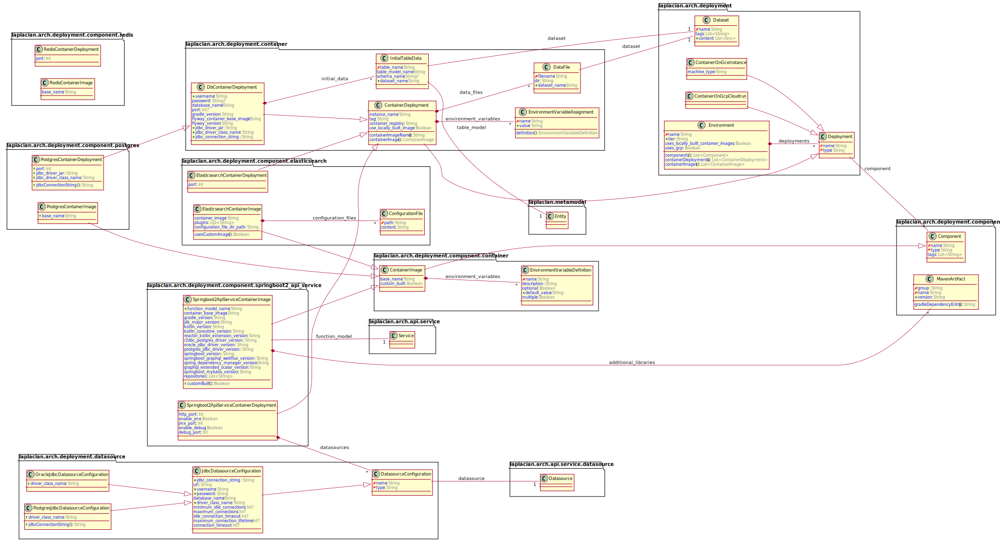

## Description of entities

### Structure

---
### **deployment_environment** (*laplacian_arch.deployment.model.DeploymentEnvironment*)
  deployment_environment

#### Properties
* **name:** *PK* `String`
  The name of this deployment_environment.

#### Relationships
* **nodes:** `List<DeploymentNode>`
  nodes

---
### **deployment_node** (*laplacian_arch.deployment.model.DeploymentNode*)
  deployment_node

#### Properties
* **name:** *PK* `String`
  The name of this deployment_node.
* **type:** `String`
  The type of this deployment_node.

#### Relationships
* **db_migration_jobs:** `List<DbMigrationJobComponent>`
  db_migration_jobs
* **environment:** `DeploymentEnvironment`
  environment
* **components:** `List<DeploymentComponent>`
  components
* **clients:** `List<ClientComponent>`
  clients
* **services:** `List<ServiceComponent>`
  services
* **datastores:** `List<DatastoreComponent>`
  datastores